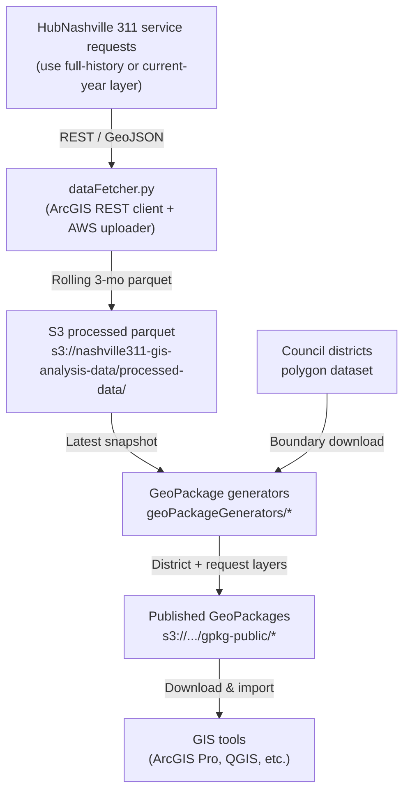

# Nashville 311 GeoPackage Pipeline

Concise documentation for the ArcGIS automation project that converts rolling three-month HubNashville 311 data into analysis-ready GeoPackages plus step-by-step ArcGIS usage guidance.

## Architecture



## What this repo contains

- Python generators under `geoPackageGenerators/` that pull the latest parquet snapshot from S3, calculate data-driven metrics, and publish `*.gpkg` files with polygon and point layers.
- A shared `README` in the GeoPackage folder with per-file summaries, output URLs, and rerun instructions.
- Automation utilities in `src/` for authentication, S3 transfers, and boundary management.
- ArcGIS Pro instructions, ModelBuilder recipes, and layout notes captured throughout the repo history.

## Data source

- **Primary feature layer:** hubNashville (311) Service Requests (2017 – Present)  
  Dataset overview: https://data.nashville.gov/datasets/9fe11d5a413240ed968f5c8d71877944_0/about
  ###
  

  REST query (GeoJSON): https://services2.arcgis.com/HdTo6HJqh92wn4D8/arcgis/rest/services/hubNashville_(311)_Service_Requests_1/FeatureServer/0/query?outFields=*&where=1%3D1&f=geojson
- **Alternate/current-year layer:** hubNashville (311) Service Requests – Current Year  
  Dataset overview: https://data.nashville.gov/datasets/hubnashville-311-service-requests-current-year/about
  ###


  REST query (GeoJSON): https://services2.arcgis.com/HdTo6HJqh92wn4D8/arcgis/rest/services/hubNashville_311_Service_Requests_Current_Year_view/FeatureServer/0/query?outFields=*&where=1%3D1&f=geojson  
  (our fetcher swaps between the full-history and current-year views depending on reporting needs)
- **Fetcher implementation:** `src/nashvilleGis/dataFetcher.py` uses the endpoints above (see `NashvilleConfig.apiUrl`) to paginate through ArcGIS REST pages, apply rolling three-month filters, and stage the data in Parquet format on S3.
- **S3 parquet staging:** `s3://nashville311-gis-analysis-data/processed-data/<timestamp>.parquet`
- **GeoPackage output prefix:** `s3://nashville311-gis-analysis-data/gpkg-public/<generatorName>/<generatorName>.gpkg`
- **Current snapshot:** Rolling three months ending 2025‑11‑24 (~49k requests across 35 districts)
- **Boundary reference:** Council Districts (Current) dataset on the Nashville Open Data Portal  
  https://data.nashville.gov/datasets/council-districts-current-1/explore  
  (the API does not ship polygon geometries, so we download this authoritative shapefile and mirror it in S3 for faster automated access)
  ###
  

- **Socrata mirror:** https://data.nashville.gov/resource/9udr-2rbj.json remains a valid JSON/CSV/SoQL alternative if ArcGIS services are unavailable.

## How the pipeline runs

1. **Fetch latest parquet:** Each generator loads the most recent file in the S3 `processed-data/` prefix.
2. **Compute metrics:** All classifications use medians, percentiles, coefficients of variation, and silhouette-guided quantiles so nothing is hardcoded.
3. **Write GeoPackage:** District polygons and service request points are written to a temporary `.gpkg`.
4. **Upload:** The GeoPackage is pushed to the public S3 prefix; the console prints the HTTPS URL for ArcGIS download.

## Re-running a generator

```bash
python3 geoPackageGenerators/capacityPlanning/capacityPlanning.py
```

Optional overrides (cloud vs local):

```python
from geoPackageGenerators.predictiveHotspots.predictiveHotspots import PredictiveHotspotsGenerator

generator = PredictiveHotspotsGenerator(bucketName='my-alt-bucket')
generator.createShapefile()  # writes locally then uploads to the specified bucket
```

To skip uploads entirely, comment out `uploadGeoPackageToS3` inside the generator and copy the local file path printed during runtime.

## API schema quick look

| Field | Example | Notes |
|-------|---------|-------|
| `request_id` | `23-001234` | Primary key |
| `request_type` | `Public Works WO` | High level grouping |
| `subrequest_type` | `Cart Services` | Specific issue |
| `status` | `Closed` | Also includes New, Assigned, Pending |
| `date_time_opened` | `2023-11-01T08:00:00.000` | ISO timestamp, converted to epoch in parquet |
| `date_time_closed` | `2023-11-02T08:00:00.000` | Null if still open |
| `council_district` | `5` | Joined to official boundary shapefile |
| `latitude`,`longitude` | `36.1678`, `-86.7784` | Point geometry source |
| `address` | `123 MAIN ST` | Cleaned to uppercase |
| `service_area` | `Solid Waste` | Operational grouping used in several generators |

All joins and enrichments happen inside the generators so analysts only need the final GeoPackages.

Sample payload snippet from the ArcGIS GeoJSON endpoint:

```json
{
  "type": "FeatureCollection",
  "properties": { "exceededTransferLimit": true },
  "features": [
    {
      "type": "Feature",
      "geometry": { "type": "Point", "coordinates": [-86.5852091275, 36.0359785075] },
      "properties": {
        "OBJECTID": 135128,
        "GlobalID": "446c7b5b-921f-43b3-a98b-bcae115a62a4",
        "Status": "Closed",
        "Request_Type": "Public_Works_WO",
        "Subrequest_Type": "Dead Animal Pickup",
        "Additional_Subrequest_Type": "Roadway",
        "Council_District": 8,
        "Latitude": 36.035978507533,
        "Longitude": -86.5852091275156,
        "Date_Time_Opened": 1757504703000,
        "Date_Time_Closed": 1757515653000,
        "ZIP": "37013",
        "Request__": "1948982"
      }
    }
  ]
}
```

## Key GeoPackages

| File | Focus | Where it lives |
|------|-------|----------------|
| `serviceEfficiency.gpkg` | Response vs workload efficiency | `gpkg-public/serviceEfficiency/` |
| `geographicPatterns.gpkg` | Density, clustering, variability | `gpkg-public/geographicPatterns/` |
| `temporalPatterns.gpkg` | Weekday vs weekend trends | `gpkg-public/temporalPatterns/` |
| `peakHourConsistency.gpkg` | Peak vs off-hour demand | `gpkg-public/peakHourConsistency/` |
| `requestVolatility.gpkg` | Stability of demand | `gpkg-public/requestVolatility/` |
| `timeBasedClusters.gpkg` | Temporal K-means clusters | `gpkg-public/timeBasedClusters/` |
| `serviceTypeInsights.gpkg` | Mix, recurring issues, complexity | `gpkg-public/serviceTypeInsights/` |
| `trendDirection.gpkg` | Upward vs downward trends | `gpkg-public/trendDirection/` |
| `predictiveHotspots.gpkg` | Multi-factor risk scoring | `gpkg-public/predictiveHotspots/` |
| `capacityPlanning.gpkg` | Utilization and time-to-capacity | `gpkg-public/capacityPlanning/` |
| `optimizationOpportunities.gpkg` | Highest impact improvements | `gpkg-public/optimizationOpportunities/` |

Open `geoPackageGenerators/README.md` for deeper per-file highlights.

## ArcGIS Pro workflow snapshot

Screenshots go here:

1. _[Add screenshot of map view or layout]_
2. _[Add screenshot of symbology or chart configuration]_

Typical sequence:

1. Download the desired `.gpkg` via the HTTPS URL printed after running a generator.
2. Drag the GeoPackage into ArcGIS Pro, confirm polygon and point layers load with camelCase fields.
3. Use the recommended techniques (Optimized Hot Spot, Cluster and Outlier, 3D scenes, map series) described in the generator docstrings.
4. Publish layouts, dashboards, or 3D scenes as needed.

## Contributing

- Keep column names in camelCase across all generators.
- Add new GeoPackages under `geoPackageGenerators/<name>/` with a dedicated script and update the folder README.
- Follow the data-driven rule: no hardcoded categories, weights, or thresholds.
- Run `read_lints` and regenerate the GeoPackage before committing.

Questions or ideas? Open an issue, or email `hello@rkatkam.com` with the subject `nashville311ArcGisPipeline - <your topic>` (the contact details live in `src/nashvilleGis/config.py` for future updates).
